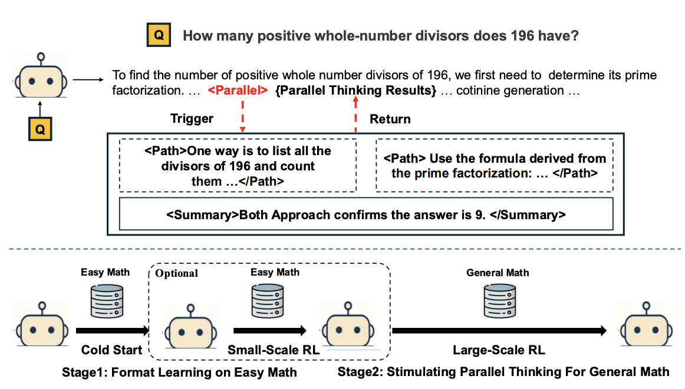

# **Parallel-R1**
The official repository for "**Parallel-R1: Towards Parallel Thinking via Reinforcement Learning**".

## **Updates**
* **2025-10-15**: 🎉Parallel-R1 was accepted at [Neurips 2025 Efficient Reasoning workshop](https://efficient-reasoning.github.io/).
* **2025-10-05**: Released Training/Evaluation code; Released [Qwen3-4B-Base with adding special tokens](https://huggingface.co/Parallel-R1) with special tokens, along with the [Parallel-Unseen (S2) 200-step](https://huggingface.co/Parallel-R1) checkpoint to support reproduction of mid-training experiments.
* **2025-09-11**: The cold-start dataset, [Parallel-GSM8K](https://huggingface.co/Parallel-R1), is now available on Hugging Face. (Stay tuned for training/evaluation codes)
* **2025-09-10**: We have released our paper, "[Parallel-R1: Towards Parallel Thinking via Reinforcement Learning](https://arxiv.org/abs/2509.07980)".


## **About**
This project introduces **Parallel-R1**, a new **reinforcement learning (RL)** framework designed to teach large language models (LLMs) **parallel thinking** for complex, real-world reasoning tasks. Unlike existing methods that rely on supervised fine-tuning (SFT) over costly, synthetic data, our approach enables models to learn parallel behaviors through RL.



## **Key Contributions**

* **A Novel RL Framework:** We present the first RL framework to learn parallel thinking on general mathematical reasoning tasks.
* **Progressive Curriculum:** The framework uses a progressive curriculum to overcome the "cold-start" problem. It begins with SFT on simpler tasks to teach the model the basic format of parallel thinking before transitioning to RL on harder problems.
* **Simple and Scalable Data Pipeline:** We developed a simple data pipeline that uses prompting on easy math problems (like GSM8K) to generate high-quality "cold-start" data, which is then used to teach the model the parallel thinking format.
* **Strategic Evolution Analysis:** We provide an in-depth analysis showing that the model's strategy evolves over the course of training. It shifts from using parallel paths for early-stage computational exploration to using them for late-stage multi-perspective verification.
* **Mid-Training Exploration Scaffold:** We empirically validate the concept of using parallel thinking as a temporary "mid-training exploration scaffold" to unlock a higher performance ceiling after RL training.

## **Main Results**

| Method | Parallel Ratio (%) | AIME25 Mean@16 | AIME25 Pass@16 | AIME24 Mean@16 | AIME24 Pass@16 | AMC23 Mean@16 | AMC23 Pass@16 | MATH Mean@1 | Avg. |
| :--- | :--- | :--- | :--- | :--- | :--- | :--- | :--- | :--- | :--- |
| **Qwen3-4B-Base** | 0.0 | 1.3 | 10.2 | 2.9 | 16.5 | 8.1 | 51.2 | 13.9 | 6.6 |
| **SFT + Parallel** | | | | | | | | | |
| Parallel-SFT-Seen | 95.6 | 8.0 | 29.8 | 10.6 | 26.4 | 48.9 | 79.2 | 76.6 | 36.0 |
| Parallel-SFT-Unseen | 95.6 | 5.2 | 20.9 | 8.5 | 26.7 | 41.7 | 80.1 | 71.5 | 31.7 |
| **RL Approach** | | | | | | | | | |
| GRPO (DAPO) | 0.0 | 14.8 | 32.4 | 18.5 | 30.6 | 63.6 | 85.1 | 83.5 | 45.1 |
| + RL on GSM8K | 0.0 | 13.3 | 26.3 | 18.8 | 34.9 | 66.4 | 82.2 | 82.6 | 45.3 |
| Parallel-R1-Seen | 27.3 | 19.2 | 38.9 | 19.4 | 37.1 | 70.5 | 85.0 | 86.7 | 48.9 |
| Parallel-R1-Unseen (S1) | 13.6 | 17.7 | 37.8 | 18.3 | 33.2 | 69.7 | 88.9 | 82.6 | 47.1 |
| Parallel-R1-Unseen (S2) | 63.0 | 19.0 | 42.2 | 16.3 | 31.8 | 67.5 | 91.5 | 84.5 | 46.8 |


## 🧱 Release Overview

| Category | Name | Description | Link |
|-----------|------|--------------|------|
| 🧠 **Models** | Qwen3-4B-Base-Special | Base model with added special tokens `<Parallel>`, `<Path>`, `<Summary>` | [🤗 Hugging Face](https://huggingface.co/Parallel-R1) |
|  | Parallel-R1-Unseen (S2) | 200-step mid-training checkpoint for reproduction of mid-training experiments| [🤗 Hugging Face](https://huggingface.co/Parallel-R1) |
| 📘 **Datasets** | Parallel-GSM8K | Cold-start dataset for teaching parallel format | [🤗 Hugging Face](https://huggingface.co/Parallel-R1) |

##  Training Logs


[🤗 Training Logs](https://api.wandb.ai/links/logical_reasoning/a538trv4)


## 🚀 Usage

### **1️⃣ Environment Setup**

We recommend using **Python 3.10+** and creating a fresh conda environment:

```bash
cd verl
conda create -n parallel-r1 python=3.10 -y
conda activate parallel-r1
USE_MEGATRON=0 bash scripts/install_vllm_sglang_mcore.sh
pip install --no-deps -e .
```

### **2️⃣ Perform SFT**

```bash
cd verl
sh training_scripts/sft_exp.sh
```

### **2️⃣ Perform RL**
To train Parallel-R1-Unseen (S1) from scratch 
```bash
cd verl
sh training_scripts/rl_exp_s1.sh
```
To train Parallel-R1-Unseen (S2) from scratch 
```bash
cd verl
sh training_scripts/rl_exp_s2.sh
```

To reproduce results of mid-training experiments
```bash
cd verl
sh training_scripts/mid_training_exp.sh
```


### Citation

If you think this work is useful, please cite our paper.

```bibtex
@article{zheng2025parallel,
  title={Parallel-r1: Towards parallel thinking via reinforcement learning},
  author={Zheng, Tong and Zhang, Hongming and Yu, Wenhao and Wang, Xiaoyang and Yang, Xinyu and Dai, Runpeng and Liu, Rui and Bao, Huiwen and Huang, Chengsong and Huang, Heng and others},
  journal={arXiv preprint arXiv:2509.07980},
  year={2025}
}

